# ECE DevOps Project

This is the DevOps project. It shows the different tools we learned during the semester but applied on one single web application.

## Work performed

### 1. Creation of the web application

First, we created a web application using **NodeJS**. We configured the server and the application to run on the **port 3000**.

For the database, we used **Redis**. The [routes](./src/routes) and [controllers](./src/controllers) folders allow us to do some changes on the user in the database, for example create a user. The file [user.js](./src/routes/user.js) in receive some routes and some data and then call the controller to do the changes.

Then, we covered the application with tests of different levels. The application is covered by **20 tests** :

- 2 for the configuration
- 1 for the Redis connection
- 9 for the user (CRUD methods)
- 8 for the user REST API

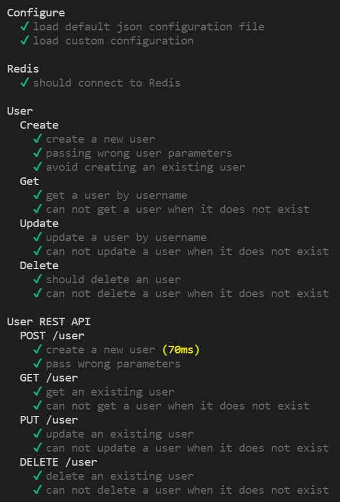

### 2. Application of CI/CD pipeline

The configuration file for CI/CD is [main.yml](/.github/workflows/main.yml)

#### Continuous Integration

First, we applied continuous integration using **GitHub Actions** to bring automation into the project. For this, we created a CI workflow for the NodeJS application. In the [main.yml](/.github/workflows/main.yml) file, you can find the configuration of the actions.

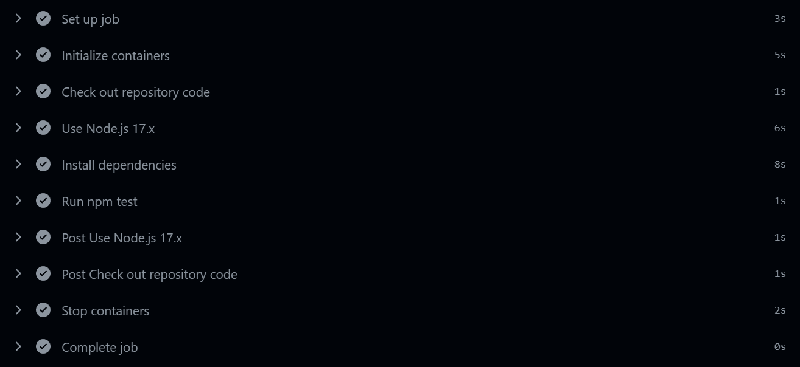

#### Continuous Deployment

To apply continuous deployment, we used **Heroku**. We configured the workflow to deploy it. On this screen, we can see that the application is deployed and linked with the **GitHub actions**.

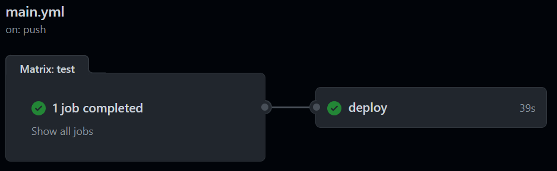

As you can see, the web application is deployed on Heroku and visible at <https://ece-devops-project-hugo-zoe.herokuapp.com/>.

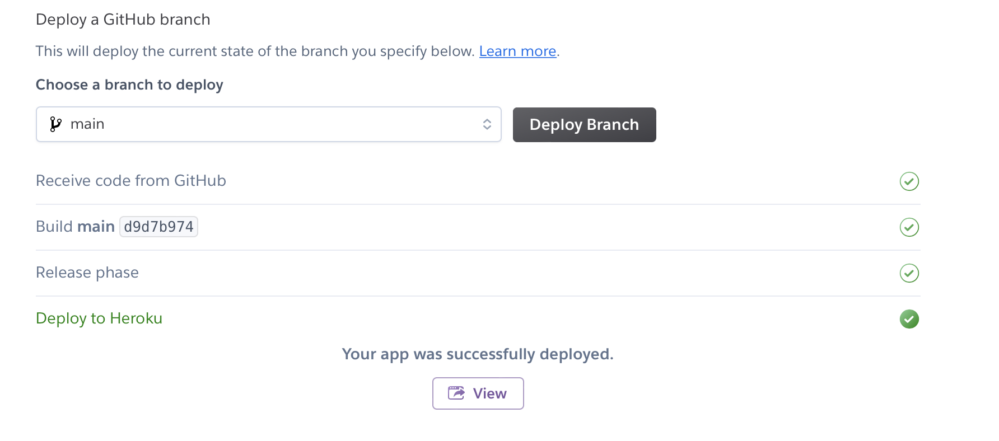

### 3. Configure and provision a virtual environment and run your application using the IaC approach

In order to configure a VM with Vagrant, we created a [Vagrantfile](./iac/Vagrantfile). Th VM is running on **CentOs/7**.

We copied the project files into the VM using `config.vm.provision "file", source : "..", destination : "$HOME/devopsproject"`.

We provisioned the VM with Ansible using **Ansible** playbook inside [run.yml](./iac/playbooks/run.yml).

Then, we configured a role to install Redis, Node and npm inside [main.yml](./iac/playbooks/roles/project/install/tasks/main.yml).

You can run `vagrant up` to bring the VM up with VirtualBox. Then, `vagrant ssh webapp_server` to go inside the VM.

`Redis` is correctly installed :

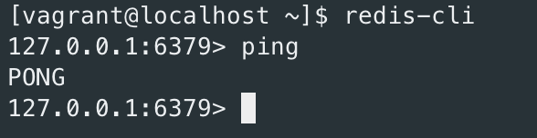

`npm` is correctly installed :

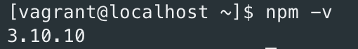

`Node` is correctly installed :

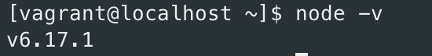

And the project files have been correctly copied :

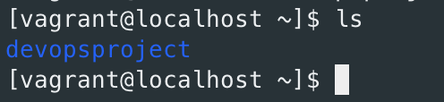

### 4. Build Docker image of your application

The [`Dockerfile`](./Dockerfile) is located at the root of the project. To build the docker image, we used the command `docker build -t devopsproject .`. This is the result on Docker Desktop using the image pulled from [Docker Hub](https://hub.docker.com/repository/docker/hbeheray/devopsproject/general) :

### 5. Make container orchestration using Docker Compose

For this step, we created a [docker-compose.yaml](./docker-compose.yaml) containing Redis and the web application at the root of the project and ran it with `docker-compose up`. This allowed us to run the project with this container.

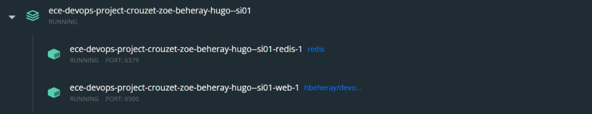

The web application is accessible from here : <http://localhost:6500/>.

### 6. Make docker orchestration using Kubernetes

First of all, we used `minikube start` to install Kubernetes cluster using **Minikube**. Then we created two deployments : [redis-deployment.yaml](/k8s/redis-deployment.yaml) and [`web-deployment.yaml`](/k8s/web-deployment.yaml).

After creating these 2 deployments, we created two services : [`redis-service.yaml`](/k8s/redis-service.yaml) and [`web-service.yaml`](/k8s/web-service.yaml).

Finally, we created [`redisvolume-persistentvolumeclaim.yaml`](/k8s/redisvolume-persistentvolumeclaim.yaml).

Then, we applied the configuration using `kubectl apply -f .` to apply all configuration files.

After that, we were able to access the service by doing `minikube service web` and the result was the following screen :

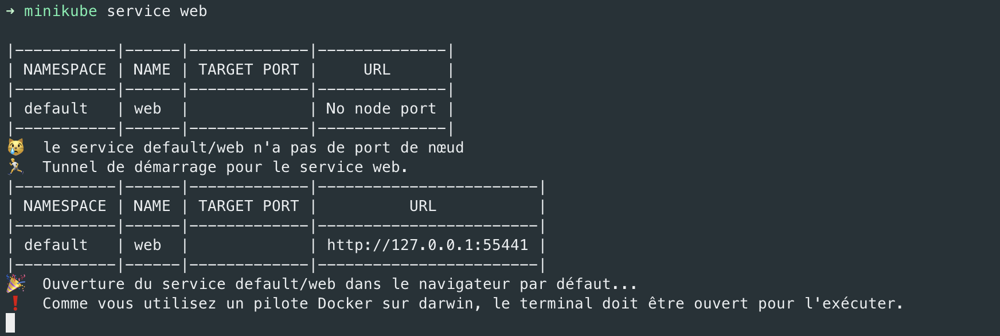

The web application is accessible at <http://127.0.0.1:55441>.

### 7. Make a service mesh using Istio

#### 1. Deploy your application using Istio

First of all, we checked the default labels by running `kubectl get ns default --show-labels`. Then, we enabled the namespace **istio injection** by running `kubectl namespace default istio-injection = enabled` in order to inject the proxy containers inside the pods.

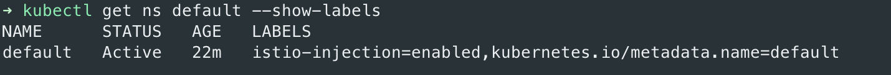

Then, we ran `kubectl apply -f .` in [`k8s`](/k8s) folder to create the deployment, pods and services for the web application in Kubernetes.

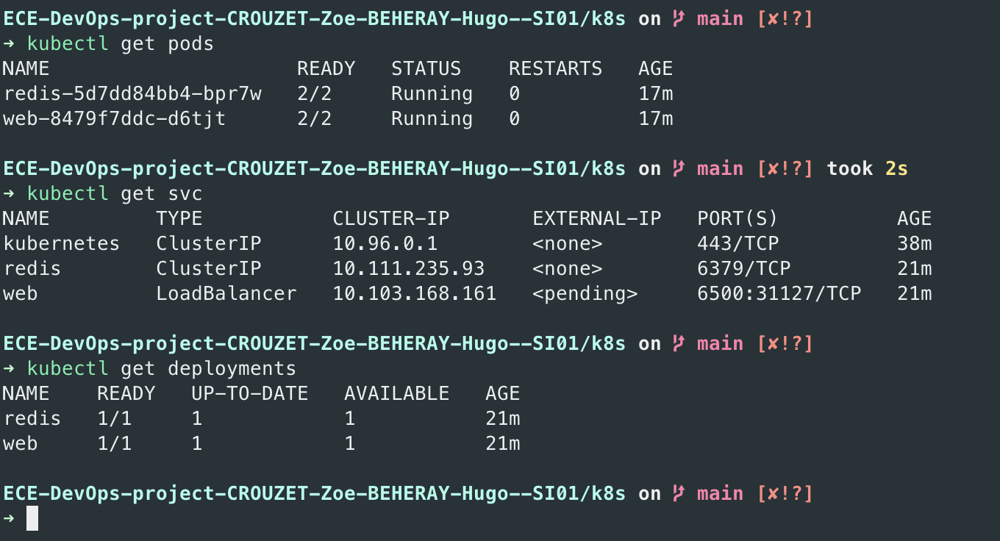

As you can see on the screen, there are 2 containers per pod because the proxies have been injected.

The web service is accessible by running `minikube service web`.

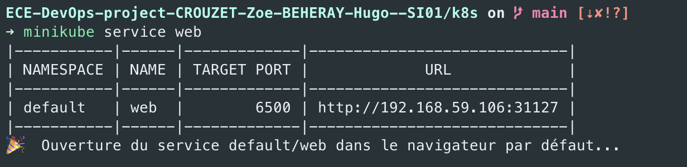

It automatically opens a web application on the browser.

When we go to postman and try to post a user and after get it, it works.

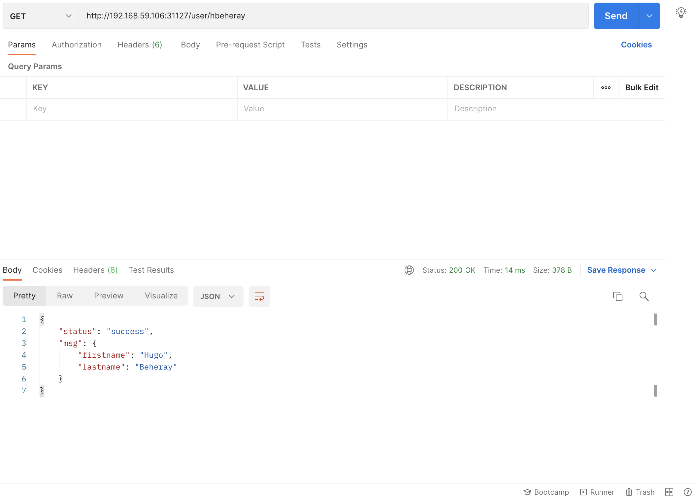

### 8. Implement Monitoring to your containerized application

In order to install **Prometheus** and **Grafana** to the k8s cluster, we took the configuration files given in the Istio installation inside `samples/addons/grafana.yaml` and `samples/addons/prometheus.yaml`. We copied them to the project. You can find them [here](./k8s/monitoring).

Then, we ran `kubectl apply -f prometheus.yaml` and `kubectl apply -f grafana.yaml` to install **prometheus** and **grafana** to the kubernetes cluster.

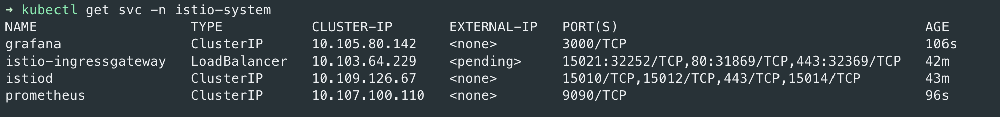

By running `kubectl port-forward svc/prometheus -n istio-system 9090` we can go to <http://localhost:9090> to display the prometheus homepage. We can run queries and see status as you can see on the 3 screens below.

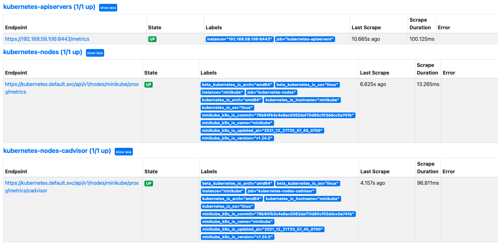
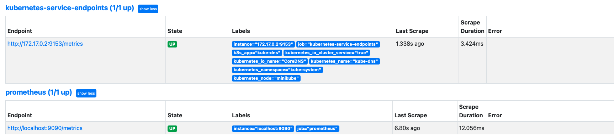
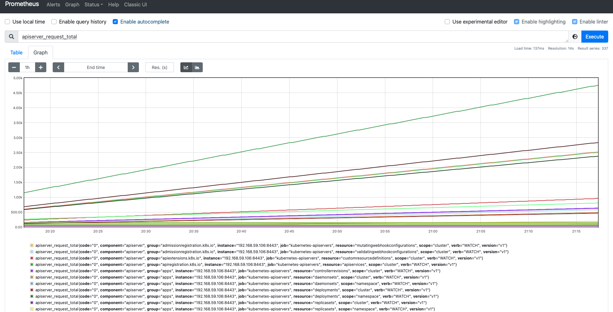

By running `kubectl port-forward svc/grafana -n istio-system 3000` we can go to <http://localhost:3000> to display the grafana homepage.

We can go to the Istio service dashboard to display some graphs about the web service. Each time we do a request on the web application, it appears on this dashboard (as presented on the screens below).

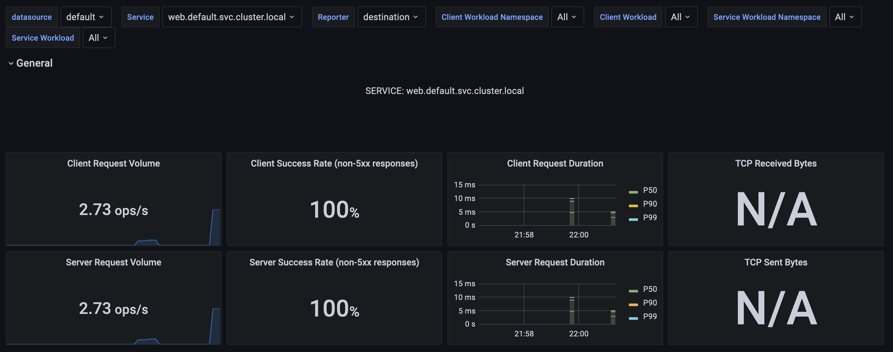
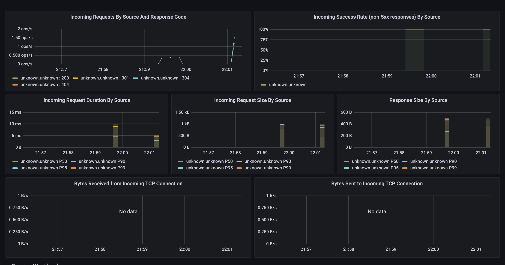
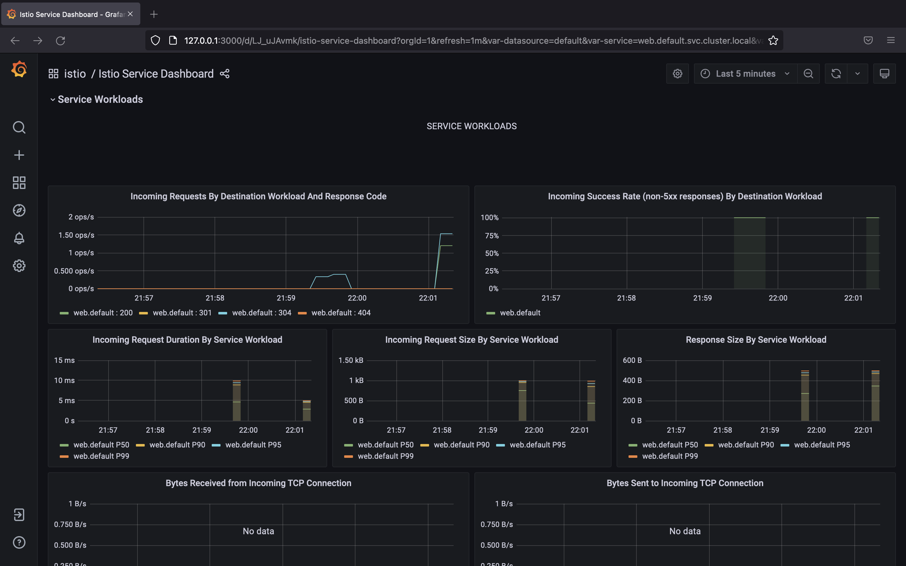

Grafana also displays the ressource usage of the service.

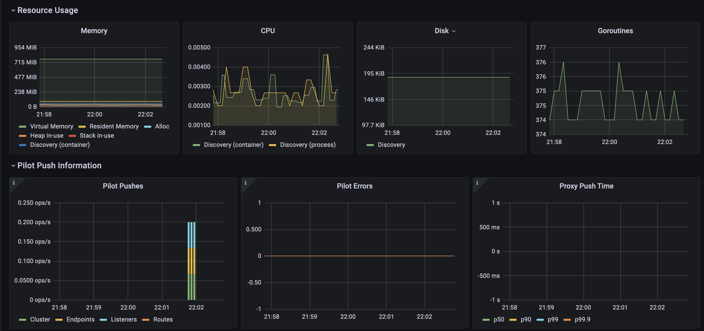

## Bonus

### 1. Swagger-UI

We used **Swagger-ui** to document our API. It is available at <http://localhost:3000/api-docs>.

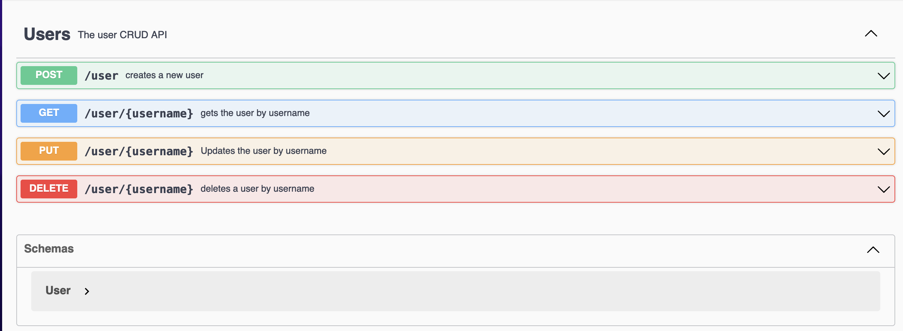

We created :

- Documentation for the user object

  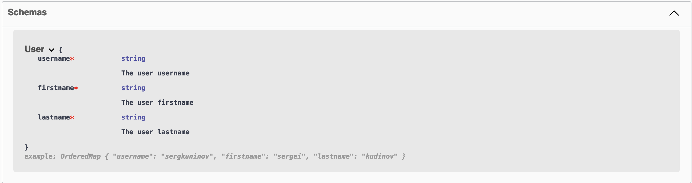

- Documentation for the POST method

  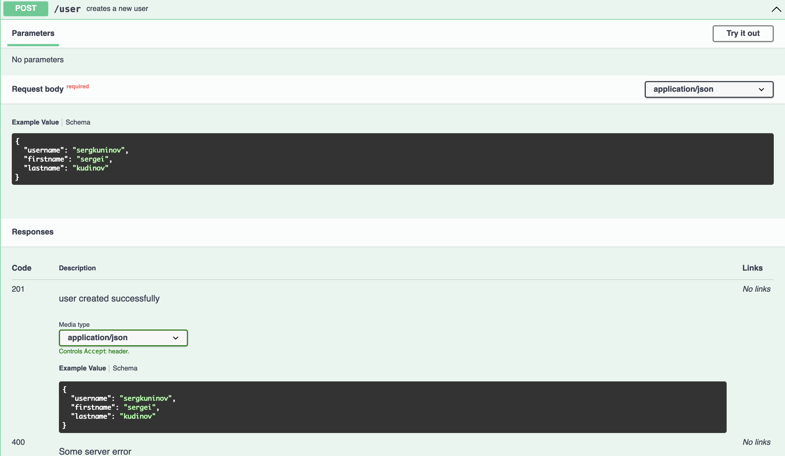

- Documentation for the GET method

  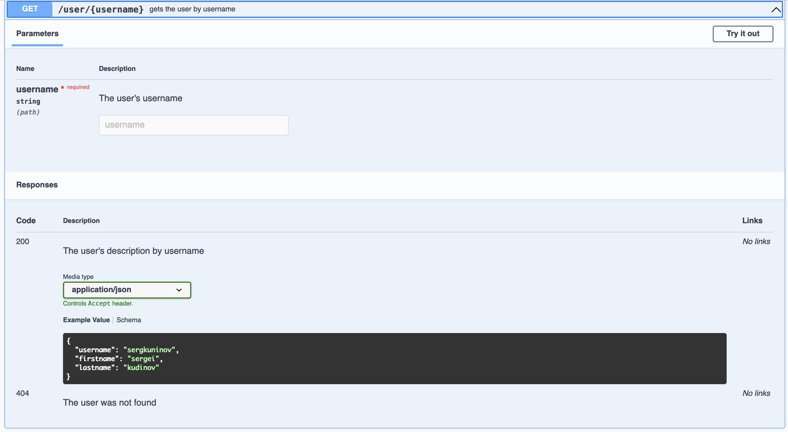

- Documentation for the PUT method

  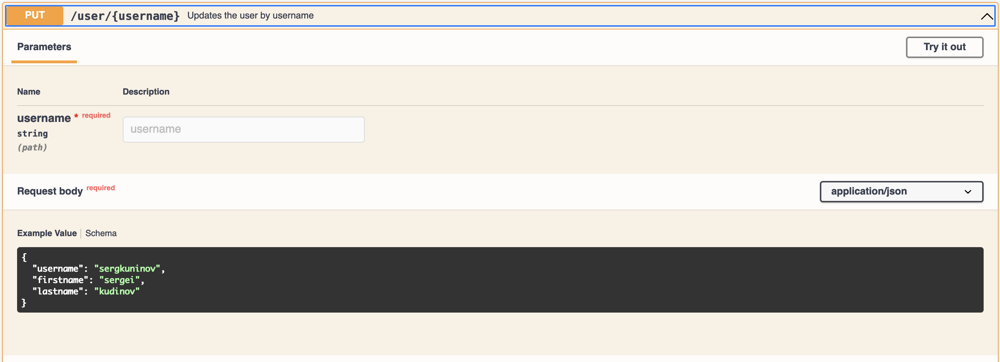
  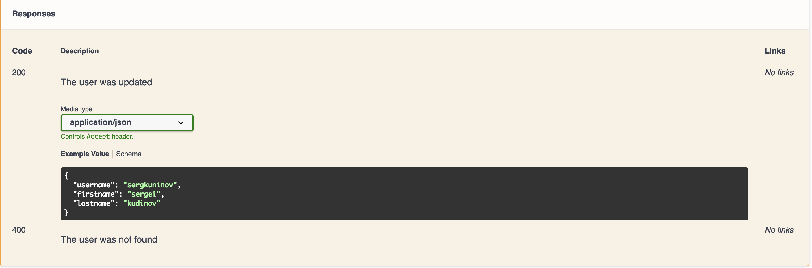

- Documentation for the DELETE method

  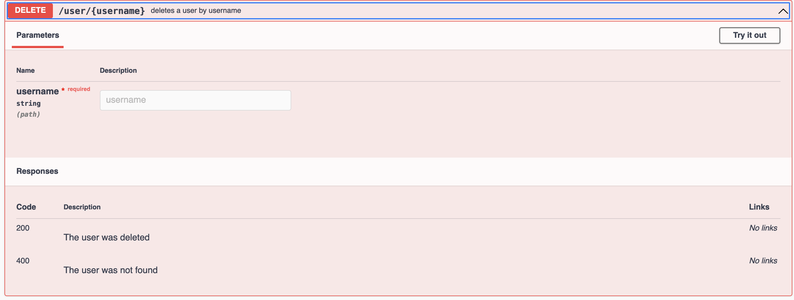

## Instructions

### Install

In order to install all the dependencies you can run `npm install`. To run the web application locally you also need to [install redis](https://github.com/adaltas/ece-devops-2021-fall/blob/master/courses/devops/modules/04.continuous-testing/lab.md#before-starting).

Or you can just use docker and pull redis image from docker hub using `docker pull redis` and run it using `sudo docker run --name my-first-redis -p 6379:6379 -d redis`.

### Use

- Check that all test are passing using `npm test`.

- Run `npm start` in your terminal.

- Navigate to <http://localhost:3000>.

#### Useful links

To open the app on Heroku : <https://ece-devops-project-hugo-zoe.herokuapp.com/>

To open the project on Docker Hub : <https://hub.docker.com/repository/docker/hbeheray/devopsproject/general>

To open Grafana : <http://localhost:3000>

To open Prometheus : <http://localhost:9090>

### Test

In order to run test you can run `npm test`. There are 20 tests which should all pass, if they don't verify that redis is running.

## Authors

Hugo BEHERAY

Zoé CROUZET

SI Group 1
