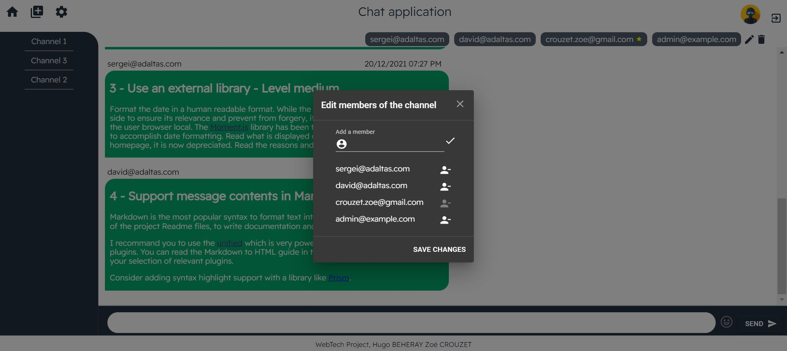

# Chat application - final project

[](https://github.com/hugobeheray/webtech/actions/workflows/main.yml)

Tchat application for the Webtech project using Node.js, Express and React.

## Usage

- Clone this repository, from your local machine:

  ```bash
  git clone https://github.com/hugobeheray/webtech.git
  ```

- Install [Go](https://golang.org/) and [Dex](https://dexidp.io/docs/getting-started/). For example, on Ubuntu, from your project root directory:

  ```bash
  # Install Go
  apt install golang-go
  # Download Dex
  git clone https://github.com/dexidp/dex.git
  # Build Dex
  cd dex
  make
  make examples
  ```

  Note, the provided `.gitignore` file ignores the `dex` folder.

- Register your GitHub application, get the `clientID` and `clientSecret` from GitHub and report them to your Dex configuration. Modify the provided `./dex-config/config.yml` configuration to look like:

  ```yaml
  - type: github
    id: github
    name: GitHub
    config:
      clientID: xxxx98f1c26493dbxxxx
      clientSecret: xxxxxxxxx80e139441b637796b128d8xxxxxxxxx
      redirectURI: http://127.0.0.1:5556/dex/callback
  ```

- Inside `./dex-config/config.yml`, the front-end application is already registered and CORS is activated. Now that Dex is built and configured, you can start the Dex server:

  ```yaml
  cd dex
  bin/dex serve dex-config/config.yaml
  ```

- Run the tests

  ```bash
  cd back-end
  # Install dependencies (use yarn or npm)
  npm install
  # Run tests
  npm test
  ```

- Start the back-end

  ```bash
  cd back-end
  # Install dependencies if you did not do it already (use yarn or npm)
  npm install
  # Optional, fill the database with initial data
  bin/init
  # Start the back-end
  bin/start
  ```

- Start the front-end

  ```bash
  cd front-end
  # Install dependencies (use yarn or npm)
  npm install
  # Start the front-end
  npm start
  ```

## Author

- Zoé CROUZET
- Hugo BEHERAY

## Tasks

Project management

- Naming convention

  Graduation : 1.5/2

  For the naming convention, our variables have explicit names as for our files.

  - The components begin with a capital letter
  - The variables and functions use the CamelCase notation
  - The code is indented

  What we could improve:

  - Some of the components are too long, some of them could have been splitted in sub-components

- Project structure

  Graduation: 4/4

  We kept the structure you gave us at the beginning of the project. There are 4 main folders:

  - `back-end` where we keep all the back-end files
  - `front-end` where we keep all the front-end files
  - `dex-config` where we keep all the dex configuration files and the docker files
  - `.github/workflows`which contains the CI configuration.

  As for the component organization, we have two main folders located in `front-end/src`, one is `channel` which contains all the components that compose a channel. All the others components are located at `front-end/src`. Each one is named with an explicit name. For example, the footer component is `Footer.js`.

- Code quality

  Graduation: 4/4

  For the code quality, we used **prettier** to auto indent on save our code in VSCode and several extensions like **ESLint** which is used for linting in JavaScript.

- Design, UX

  Graduation: 3/4

  We did a simple and clean design with a lot of mui components, especially material icons. We also added css styling on the different components.

  As for the UX, we find it enough easy to use and intuitive. There are some toolips on the buttons and dialog windows for confirmation.

  What we could improve:

  - An even better css styling
  - An even better UX design, for example we could have displayed the profile picture on every message

- Git and DevOps

  Graduation: 2.5/4

  We used git to commit and push our changes on a branch `project`. Before, for the labs, we also used various branches. When the work is done, we merge the branch into main. Each commit's name uses the conventional commit method and is labbeled with a keyword like `feat:` or `fix:` plus the changes we made.

  For example, `feat: updated Readme.md with graduation and comment`.

  On top of that, we have a CI which runs unit tests when we push in `project`and `main`. So each time we want to merge a branch into `main` we check that all the tests are passing in Github Action. You can find the CI configuration [`here`](/.github/workflows/main.yml).

  Additionnaly, **we contenarised dex**.You can run `docker-compose up` ro run dex inside `/dex-config`. Here are the [`Dockerfile`](/dex-config/Dockerfile) and the [`docker-compose.yaml`](/dex-config/docker-compose.yaml).

  What we could improve:

  - Adding CD with heroku (we tried)
  - Use more branches for implementing main functionnalities

Application development

- Welcome screens

  Graduation : 3/4

  

  For the welcome screen, it displays the main functionnalities you can do.

  - On the left of the page, you can see all the channels you are in. In example, this user is in the channel 1,2 and 3. You can also click on each channel.
  - On the top left corner you can go back to the homepage, create a new channel and edit your settings.
  - On the top right corner, you can logout or change your profile picture.
  - On the center of the page you can read the main functionnalities and directly doing some of them thanks to the call-to-actions.

  The source code of the welcome page is in [Welcome.js](/front-end/src/Welcome.js)

  What we could improve:

  - More features on the welcome page.
  - Better styling

- New channel creation

  Graduation : 6/6

  

  You can create a new channel by adding a name for the channel and members (with their emails). If the connected user didn't enter his own email he will be automatically added to the channel. The creator of the channel is **always** the administrator.

  Each time you click on the check button, the user is displayed under the input , as you can see on the screen.

  You can cancel the channel creation by clicking on the CANCEL button and you will be redirected to the homepage.

  The channel is saved in the database.

  The source code of the welcome page is in [CreateChannel.js](/front-end/src/CreateChannel.js)

- Channel membership and access

  Graduation : 1/4

  When you log in for the first time (unregistered email address), a new user account is created in the database with the associated email and default parameters (i.e profile picture).

  These informations are stored in the cookies with Oauth information.

  The source code of this feature is in [Login.js](/front-end/src/Login.js) in `LoadToken` function (line 101)

  What we could improve:

  - Every request sent to the API could have contained the user access token in the HTTP header.

- Ressource access control

  Graduation : 3.5/4

  Once logged inn all the accessible channels by the user (channels he was invited to) are displayed in the channel list. This is controlled in the backend to avoid security issues.

  If you try to access a channel which you are not a member of (i.e by entering another channel id in the url), it will redirect you to the `Oups page`.

  What we could improve:

  - Adding a specific page for unexpected access and intrusion attempts instead of redirecting to `Oups`

  The source code of this feature is in [db.js](/back-end/lib/db.js)

- Invite users to channels

  Graduation : 6/6

  

  You can invite new users to the channel if you are the admin of the channel. You just have to enter the new user's email address in the input field. You can choose to save the changes or to cancel the action. When you choose to save the changes the new members are stored in the database.

  The admin is designated by a star next to his email.

  The source code of this feature is in [Members.js](/front-end/src/channel/Members.js)

- Message modification

  Graduation : 1.5/2

  

  We can edit a message **we** sent by clicking on the edit icon. When you are on editing mode, the message is transformed to an input field with a check button to apply the changes.

  What we could improve:

  - The page auto reload to apply changes, we could only have reloaded the component.

  The source code of this feature is in [List.js](/front-end/src/channel/List.js)

- Message removal

  Graduation : 1.5/2

  We can remove a message **we** sent by clicking on the remove icon.

  What we could improve:

  - The page auto reload to apply changes, we could only have reloaded the component.

  The source code of this feature is in [List.js](/front-end/src/channel/List.js)

- Account settings

  Graduation : 1/4

  

  You can only change the name but you can see your email address and your id.

  We tried to implement the language functionnality but we did not achieve it. We tried to use the i18n package. That is why the button is disabled.

  The new user's settings are stored in Oauth cookies.

  The source code of this feature is in [Settings.js](/front-end/src/Settings.js)

- Gravatar integration

  Graduation : 2/2

  

  To implement Gravatar we found a component on the internet that we adjusted to match with the email of the connected user. When you click on the profile picture on the top right corner, you can choose to set your profile picture with Gravatar. His choice is saved in the database.

  The source code of this feature is in [Gravatar.js](/front-end/src/Gravatar.js)

- Avatar selection

  Graduation : 4/4

  The user has the possibility to choose an avatar within five avatars, as you can see on the previous screen. Once he picked one, the current profile picture is replaced with the new avatar and his choice is saved in the database.

  The source code of this feature is in [Header.js](/front-end/src/Header.js)

- Personal custom avatar

  Graduation : 4/6

  The last option for the profile picture is to upload a new one. You can drag and drop or click on the choose a file input as you can see on the previous screen. Then you have to click on upload to upload the picture in a folder called [uploads](/front-end/src//uploads). In order to do so, we used `multer`.

  The choice is saved in the database.

  Filters for the file size are implemented.

  What we could improve:

  - Filter for the file format
  - Convert a picture in base64 and store it to the database

  The source code of this feature is in [Header.js](/front-end/src/Header.js)

## Bonus

- Emojis implementation :

  We implemented emojis using [react-input-emoji](https://cesarwbr.github.io/react-input-emoji/)

- Remove user from a channel

  

  It is also possible to remove a member from the channel except if it is the admin.

- Remove a channel

  

  We can also remove a channel by clicking on the trash button when on a channel page logged in as the admin.
